# Manuel d'annotation sur OHIF
Rendez-vous sur le site [https://wediagnostix.github.io/](https://wediagnostix.github.io/) pour débuter l'annotation.

## Ouvrir un DICOM multicouche
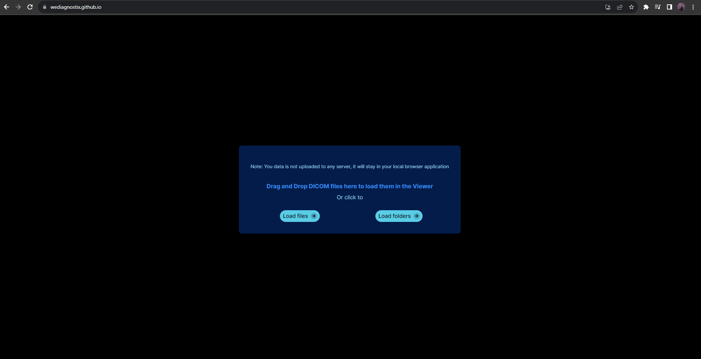</img> \
Cliquez sur **Load folders** pour ouvrir un dossier de dicom multicouches.  
**ATTENTION :** Vous ne pouvez pour l'instant pas ouvrir de DICOM 3D sous la forme d'un seul .dcm. Pour l'instant, OHIF et Cornerstone3D ne supportent que le loading de DICOM 3D sous la forme d'un dossier de .dcm monocouche.

## Débuter l'annotation
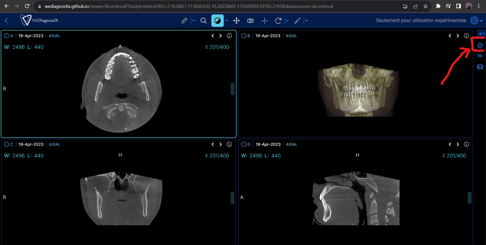</img> \
Cliquez sur l'icone "Segmentation" pour ouvrir le panneau des annotations. \
Pour l'instant, aucune segmentations n'est associée au volume. Cliquez sur "Create Segmentation For Selected Viewport"
pour lancer l'outil d'annotation au volume designé. 

## Modifier / Ajouter / Supprimer un segment
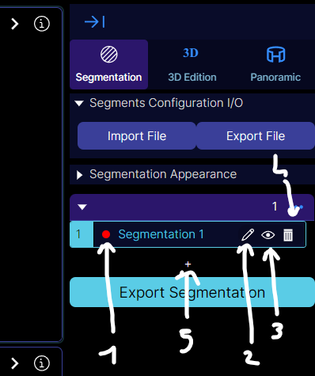</img> \
Chaque segment est presenté dans la liste ci-dessus. Il correspond a une catégorie que vous souhaitez annoter.
Vous pouvez changer sa couleur (1), son label (2), afficher ou cacher le segment sur le volume annoté (3) (il ne sera pas caché dans l'export final). \
Pour supprimer le segment, cliquez sur (4). Toutes les annotations realisées sur le volume associé a cette categorie seront supprimés. \
Pour ajouter un nouveau segment, cliquez sur (5).

## Import / Export de configurations de segment
Pour éviter de devoir refaire a la main les categories que vous souhaitez annoter, vous pouvez exporter et importer
des fichiers de configuration de segment. \
Dans la catégorie "Segments Configuration I/O", cliquez "Export File". Un fichier nommé *segments_configuration.json* sera
enregistré sur votre machine. \
Lorsque vous aurez chargé un nouveau volume pour recommencer une nouvelle annotation, il vous
suffira de cliquer sur "Import File" et de choisir le fichier exporté dans votre explorateur pour charger
les segments créé précedemment.

## Outils d'annotation

Une fois que vous aurez cliqué dans la liste des segments la catégorie que vous souhaitez annoter sur le volume,
vous pourrez dessiner a l'aide de plusieurs outils. \
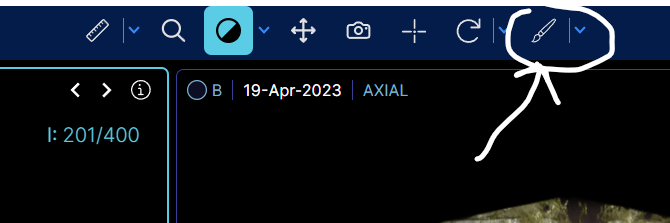</img> \
Cliquez sur cet icone a droite de votre barre d'outil pour selectionner le premier tool d'annotation.
En cliquant sur la fleche a droite du pinceau, vous pourrez choisir d'autres outils : \
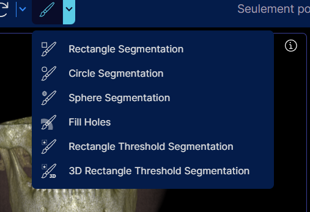</img> 

### A savoir pendant l'annotation
Meme si vous utilisez un outil d'annotation, vous pouvez quand meme zoomer / dezoomer sur le CBCT en utilisant
le **clic droit**.\
Vous pouvez aussi utiliser le **clic molette** pour deplacer la radio. \
Utilisez  **clic gauche** sur la radio pour dessiner avec votre outil. 

Lorsque vous effacez des annotations, peu importe l'outil, vous avez une section "Erase Options"
que vous pouvez expandre pour concentrer la suppression sur une categorie d'annotation :\
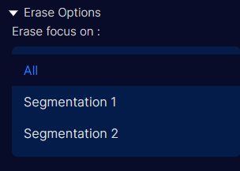</img> \
En selectionnant une categorie en particulier, les autres ne subiront pas l'effacage meme si vous passez
par dessus.\

Lorsque vous faites un threshold avec le Brush ou le Rectangle Threshold, vous pouvez utiliser le slider
pour selectionner les intervalles de valeur d'HU mais aussi l'outil pipette en dessous du slider :\
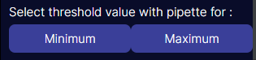</img> \
En cliquant sur l'un des deux, l'outil "Sonde" s'activera. Maintenez alors le clic gauche enfonce sur la radio pour 
voir la valeur et set le threshold en fonction de la valeur sur laquelle vous etes.
Cliquez ensuite sur "Back to annotation" pour continuer la peinture.

Si vous voulez annuler vos dernieres actions, vous pouvez cliquer sur le bouton "Undo"
dans la section "Undo / Redo Segmentation" du panneau de segmentation. De la meme
maniere, cliquez sur "Redo" et la precedente action annulee reviendra. \
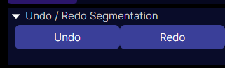</img> 

### Paint Brush

Il est l'outil chargé de base lorsque vous cliquez sur le pinceau. Lorsque l'outil sera activé, 
une section apparaitra sur le panneau de segmentation : \
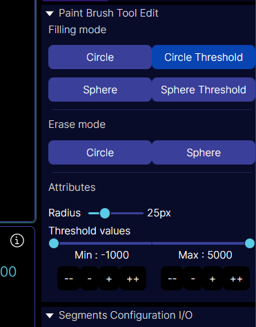</img> \
**Filling mode** : Correspond au mode de votre pinceau. Circle peint uniquement sur la couche affichée
tandis que Sphere se propage sur les couches suivantes et precedentes. Le mode "Threshold" peint uniquement
sur les pixels dont la valeur HU correspond a l'intervalle précisé dans le slider. \
**Erase mode** : Meme principe que le filling, mais efface a la place de dessiner. \
**Radius** : Faites varier la taille du pinceau avec ce slider.

### Rectangle / Circle / Sphere Segmentation
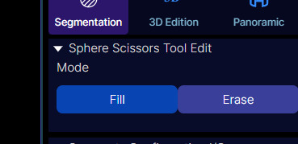</img> \
Comme leur nom l'indique, ils permettent de tracer cercle, sphere et rectangle sur la radio. 
 

### Fill Holes

Lorsque cet outil est activé, cliquez sur une zone delimitée par une annotation pour compléter le trou : \
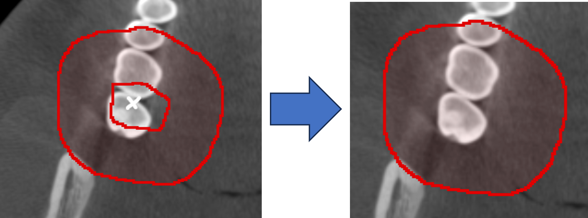</img> 

### (3D) Rectangle Threshold Segmentation
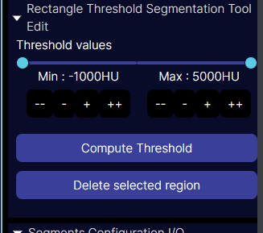</img> \
Avec cet outil, dessinez dans un premier temps un rectangle sur la radio, et cliquez ensuite
sur "Compute Threshold". L'annotation résultante sera constitué des pixels delimités par le rectangle dessiné
dont la valeur HU se situe dans l'intervalle de Threshold. \
En version 3D, l'outil aura un slider en plus "Slice Propagation" qui indiquera sur combien de couches l'annotation
se propage.

## Export des annotations
Lorque l'annotation est complétée sur le volume, cliquez sur "Export Segmentation".\
Apres un petit temps d'attente, une archive *segmentation.zip* sera telechargée.
Dans cet archive, vous retrouverez pour chaque couche une image PNG. \
Vous trouverez aussi un fichier JSON avec les indications de couleurs et nom des categories que vous venez d'annoter.
Vous pourrez importer ce fichier dans votre prochaine annotation pour importer les categories d'annotation sans avoir
a les recréer a la main (voir partie *Import / Export de configurations de segment*).

